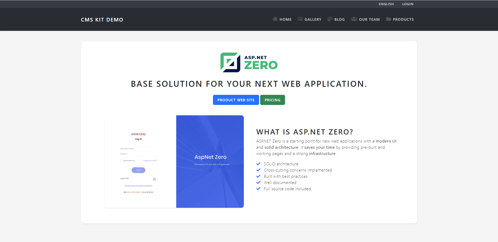

# CMS Kit Demo

This is a sample application designed to demonstrate the capabilities of the [ABP Framework](https://github.com/abpframework/abp)'s [CMS Kit Module](https://docs.abp.io/en/abp/latest/Modules/Cms-Kit/Index).

## Requirements

* .NET 7.0+

## How to run?

Before running the application, you should run the following command in the `CmsKitDemo` folder to install all NPM packages for the application:

```bash
abp install-libs
```

After installing the NPM packages, you can directly run the `CmsKitDemo` project to see the application. This application uses SQLite as the database and the database can be found in the solution folder. Therefore, you don't need to create the database manually.

> Default credentials: `admin` as username and `1q2w3E*` as the password.

## Screenshots

### Homepage

The application menu items (gallery, blog, ...) are created & ordered dynamically with [CMS Kit's Menu System](https://docs.abp.io/en/abp/latest/Modules/Cms-Kit/Menus):


### Image Gallery

Custom implementation (image gallery) with CMS Kit’s [Comment](https://docs.abp.io/en/abp/latest/Modules/Cms-Kit/Comments) & [Reaction](https://docs.abp.io/en/abp/latest/Modules/Cms-Kit/Reactions) Features integrated:

| Gallery | Detail Page  |
|------------------------ |-----------------------|
|  |   |

### Blog & Blog Posts

[Blogging Feature](https://docs.abp.io/en/abp/latest/Modules/Cms-Kit/Blogging) (with [Ratings](https://docs.abp.io/en/abp/latest/Modules/Cms-Kit/Ratings), [Comments](https://docs.abp.io/en/abp/latest/Modules/Cms-Kit/Comments), [Tags](https://docs.abp.io/en/abp/latest/Modules/Cms-Kit/Tags), and [Reactions](https://docs.abp.io/en/abp/latest/Modules/Cms-Kit/Reactions) features as enabled):

| Blog | Blog Post  |
|------------------------ |-----------------------|
|  |   |

### Products pages

*Our Team* and *Products* uses the [Pages Feature](https://docs.abp.io/en/abp/latest/Modules/Cms-Kit/Pages) of the CMS Kit Module (with dynamic content, styles & scripts):

| products/abp-commercial | products/aspnet-zero  |
|------------------------ |-----------------------|
|  |   |

## See live

This application is live at [cms-kit-demo.abpdemo.com](https://cms-kit-demo.abpdemo.com/).
