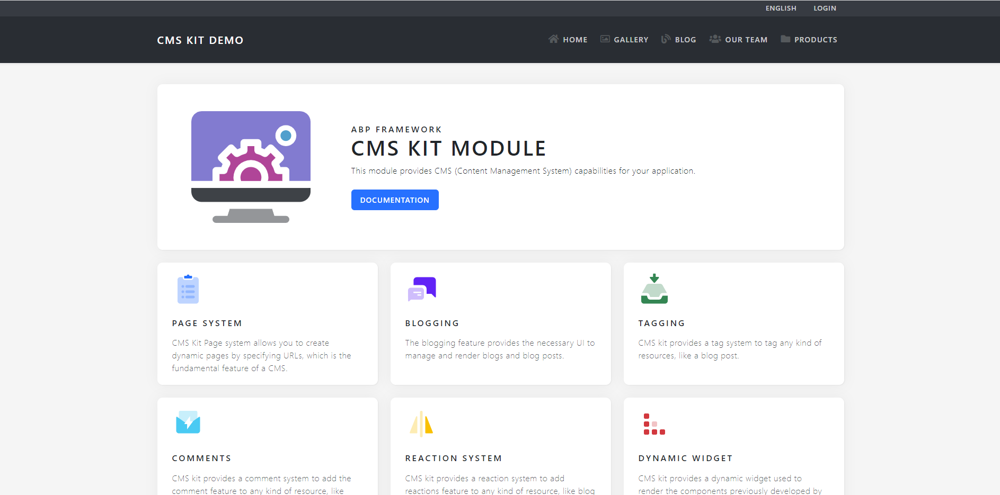
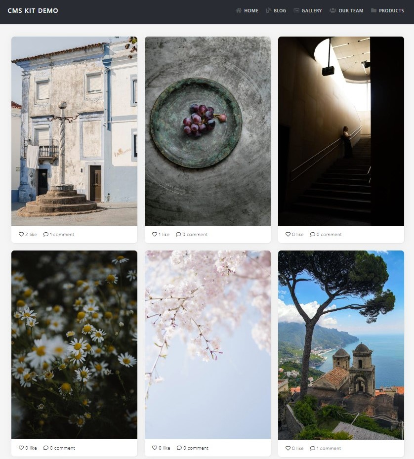
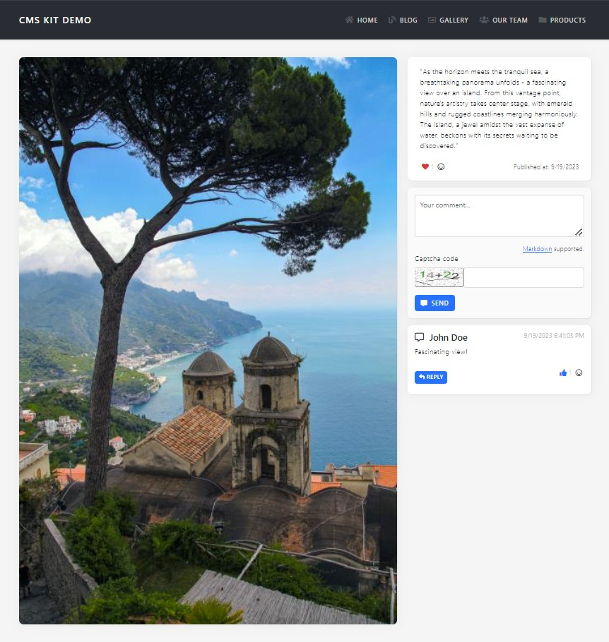
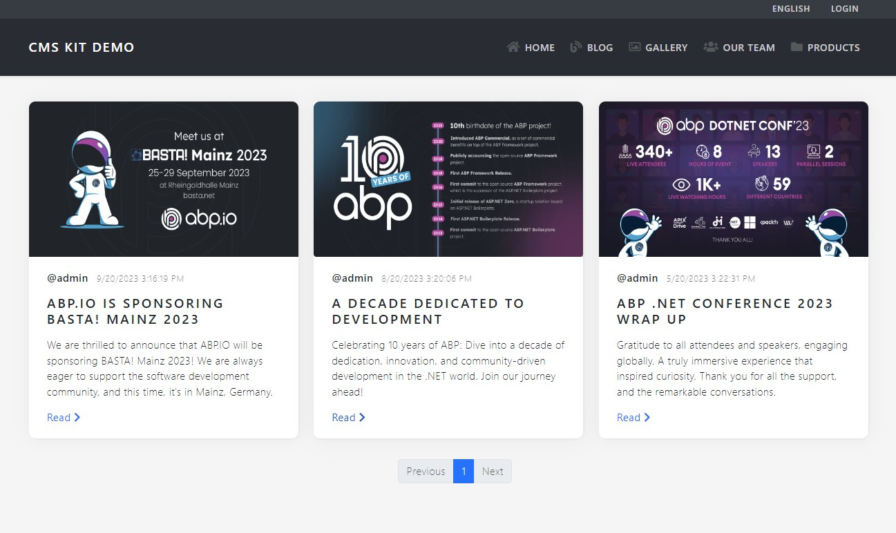
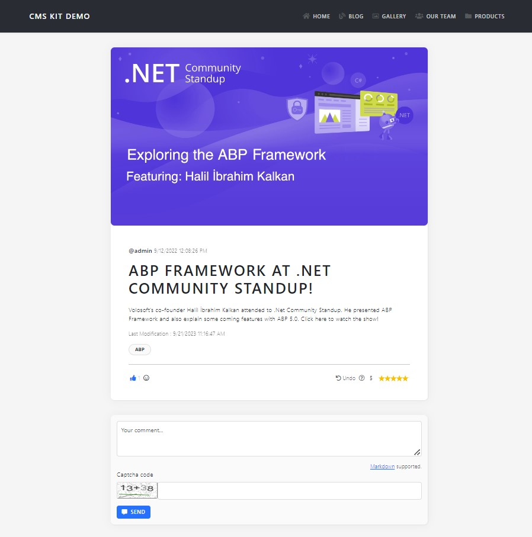
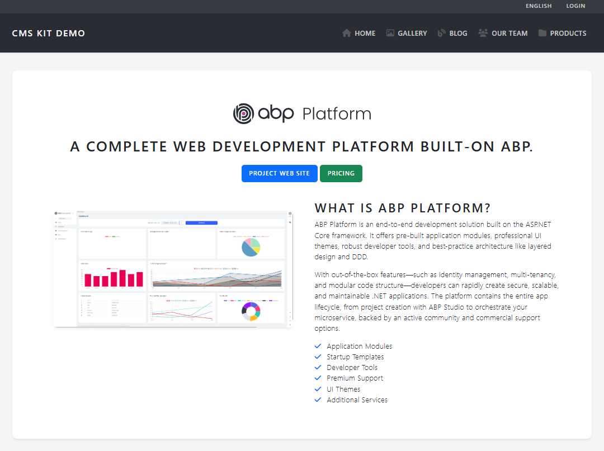
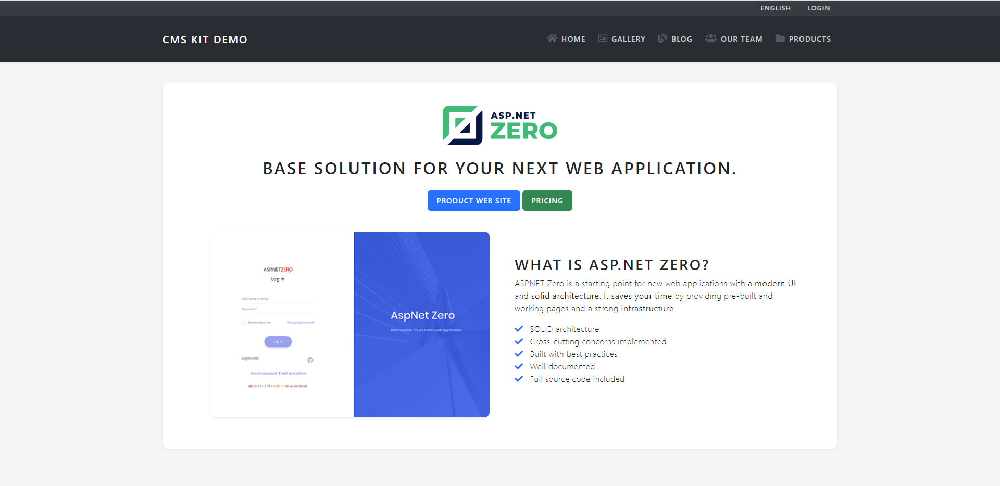

# CMS Kit Demo

This is a sample application designed to demonstrate the capabilities of the [ABP](https://github.com/abpframework/abp)'s [CMS Kit Module](https://abp.io/docs/latest/modules/cms-kit/index). The source project is maintained at [abpframework/cms-kit-demo](https://github.com/abpframework/cms-kit-demo).

## Live Demo

You can see the [live demo here](https://cms-kit-demo.abpdemo.com/).

## ABP Community Talks

We've organized a community talk to show CMS Kit's capabilities and used this solution for demonstration. You can watch the community talk from here: https://www.youtube.com/watch?v=S9__Hnu29tI

## Requirements

* .NET 10.0+
* ABP CLI 10.4.1+ (for `abp install-libs`)
* Node.js with Yarn v1 support for MVC UI package restore

## How to run?

### Run with ABP Studio

This repository includes an ABP Studio Solution Runner profile at `etc/abp-studio/run-profiles/Default.abprun.json`.

When the solution is opened in ABP Studio, run the `Initialize Solution` task from the Solution Runner's **Tasks** tab. This initial task runs once per computer and executes `etc/abp-studio/scripts/initialize-solution.ps1`, which:

* installs MVC UI libraries with `abp install-libs`;
* applies EF Core migrations and seeds the SQLite database with `dotnet run --migrate-database`.

After the initial task completes, start the `CmsKitDemo` application from the Solution Runner. See the [ABP Studio Solution Runner documentation](https://abp.io/docs/latest/studio/running-applications) for more information about applications and initial tasks.

### Run manually

Before running the application manually, install all MVC UI packages from the `src/CmsKitDemo` folder:

```bash
abp install-libs
```

Then apply migrations and seed the SQLite database:

```bash
dotnet run --migrate-database
```

Finally, run the web application:

```bash
dotnet run
```

This application uses SQLite and the database file is included under the `CmsKitDemo` project folder, so you don't need to create a database server manually. For more background, see the [CMS Kit module documentation](https://abp.io/docs/latest/modules/cms-kit/index) and the [ABP single-layer application running guide](https://abp.io/docs/latest/get-started/single-layer-web-application).

> Default credentials: `admin` as username and `1q2w3E*` as the password.

## Screenshots

### Homepage

The application menu items (gallery, blog, ...) are created & ordered dynamically with [CMS Kit's Menu System](https://abp.io/docs/latest/Modules/Cms-Kit/Menus):



### Image Gallery

Custom implementation (image gallery) with CMS Kit’s [Comment](https://abp.io/docs/latest/Modules/Cms-Kit/Comments) & [Reaction](https://abp.io/docs/latest/Modules/Cms-Kit/Reactions) Features integrated:

| Gallery | Detail Page  |
|------------------------ |-----------------------|
|  |   |

### Blog & Blog Posts

[Blogging Feature](https://abp.io/docs/latest/Modules/Cms-Kit/Blogging) (with [Ratings](https://abp.io/docs/latest/Modules/Cms-Kit/Ratings), [Comments](https://abp.io/docs/latest/Modules/Cms-Kit/Comments), [Tags](https://abp.io/docs/latest/Modules/Cms-Kit/Tags), and [Reactions](https://abp.io/docs/latest/Modules/Cms-Kit/Reactions) features as enabled):

| Blog | Blog Post  |
|------------------------ |-----------------------|
|  |   |

### Products pages

*Our Team* and *Products* uses the [Pages Feature](https://abp.io/docs/latest/Modules/Cms-Kit/Pages) of the CMS Kit Module (with dynamic content, styles & scripts):

| products/abp-platform | products/aspnet-zero  |
|------------------------ |-----------------------|
|  |   |

